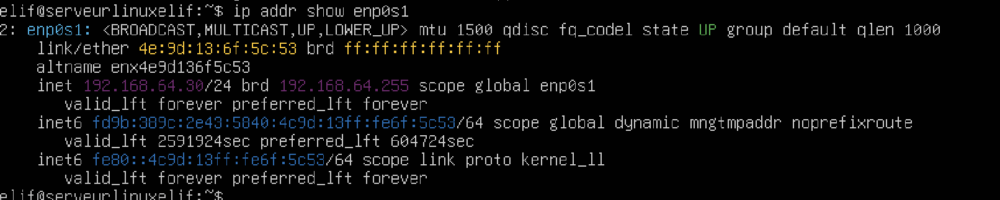
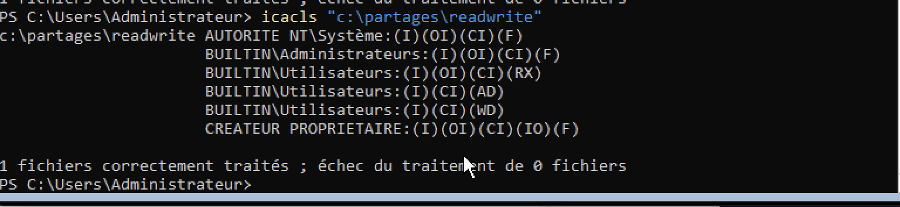

# Document d'Architecture Technique (DAT)

## 0 — Métadonnées
- **Projet** : Lab AD + Linux app (VulnerableLightApp)  
- **Auteur** : Elifsu JAFFRES  
- **Branche repo** : `main`  
- **Date** : 2025-10-16  
- **Emplacement des captures** : `images/`  
- **Emplacement gestionnaire de secrets** : sur MacBook

---

## 1 — Résumé du périmètre

**But** : déployer un environnement de test vulnérable et réaliste composé de :
- 1 Windows Server = Contrôleur de domaine (AD + DNS + WinRM + SMB + BadBlood)
- 1 Windows Workstation = client joint au domaine (non déployé — tests réalisés depuis Mac)
- 1 Linux Server (Ubuntu) = application métier (VulnerableLightApp) + SSH

**Livrables** : preuves listées en §7, DAT au format PDF envoyé.
Voici le diagramme de Gantt lié au planning du projet :


---

## 2 — Schéma réseau

- **Hyperviseur** : UTM (VMs hébergées sur la machine hôte)  
- **Mode réseau** : NAT (réglage utilisé pour les mises à jour)


---

## 3 — Caractéristiques des machines

### Windows Server (AD DC)
- **vCPU** : 2
- **RAM** : 4 GiB
- **Disk** : 40 GiB
- **IP** : 192.168.64.10
- **Rôles** : AD DS, DNS, SMB, WinRM


### Windows Client (théorie / non déployé)
- **vCPU** : 2
- **RAM** : 4 GiB
- **Disk** : 40 GiB


### Ubuntu Server
- **vCPU** : 1
- **RAM** : 2 GiB
- **Disk** : 20 GiB
- **IP** : 192.168.64.30
- **Services** : SSH (sudoers), dotnet / VulnerableLightApp (Kestrel)


---

## 4 — Plan d'adressage

- **Réseau lab** : 192.168.64.0/24  
- **Passerelle (virtuel)** : 192.168.64.1  
- **DC** : 192.168.64.10  
- **Linux** : 192.168.64.30

### Configuration IP Windows Server


### Configuration IP Ubuntu





---

## 5 — Exemples de comptes créés

- **labadmin** (local/AD) — privilège admin — mot de passe de test : `LabAdmin123` (stocké localement)  
- **labuser** (local) — compte non‑admin

---

## 6 — Services déployés & état (preuves et commandes)

### DNS (AD)

**Commandes** : `Get-Service DNS` / `Get-DnsServerZone`


---

### WinRM

**Test** : `Test-WSMan -ComputerName 192.168.64.10`


---

### SMB (DC)

**Vérif DC** : `Get-SmbShare`


**Vérif montage Ubuntu** :




---

### Web (Ubuntu)

**Service systemd** : `/etc/systemd/system/vla.service`

**Commandes** : `sudo systemctl status vla.service`, `journalctl -u vla.service`, `ss -ltnp`

**Preuves service & écoute** :


**Tests HTTP** :


---

### SSH (Ubuntu)

**Captures / preuves** :


---

### BadBlood

**Script exécuté sur le DC**


---

## 7 — Preuves / captures

### ISO / Hashs


### VM / hyperviseur screenshots


### Mises à jour


### IP / config réseau


### SSH connect (Ubuntu)


### WinRM / remote PowerShell


### SMB shares & tests


### VLA (service + HTTP tests)


### AD users / groups


### BadBlood execution


### Divers / annexes


---

## 8 — Procédures / commandes utiles

### Vérif écoute VLA
```bash
sudo systemctl status vla.service -l
sudo journalctl -u vla.service -n 200 --no-pager
ss -ltnp | grep dotnet
```

### Commandes Active Directory
```powershell
Get-ADDomain
Get-ADUser -Filter *
Get-ADGroup -Filter *
Get-Service DNS
Get-DnsServerZone
```

### Commandes SMB
```powershell
Get-SmbShare
```
```bash
# Montage depuis Ubuntu
sudo mount -t cifs //192.168.64.10/partage /mnt/smb -o username=labadmin
```

### Test WinRM
```powershell
Test-WSMan -ComputerName 192.168.64.10
Enter-PSSession -ComputerName 192.168.64.10 -Credential (Get-Credential)
```
